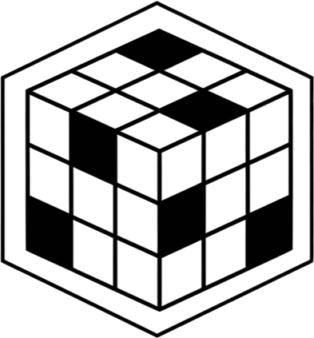

<p align="center">
  
</p>

# **3D Rubik’s Cube Solver – Web App**

A fully interactive **3D Rubik’s Cube** built for the web, complete with a real cube structure, visual rendering, and an automatic solver. Rotate it, scramble it, inspect individual pieces, and watch it solve itself—all in the browser.

# **How It Works**

## **Cube Structure**

The Rubik’s Cube is represented as an **array of pieces**.
Each **piece** is an object that contains:

- Its **position** in 3D space (logical cube coordinates, not world coordinates).
- An array of **sides**, describing:

  - Which directions the piece is facing.
  - The identity of each face (e.g., `U4`, `F2`, etc.).

### **Side Representation**

Each piece has a `sides` array.
The array always includes entries for all possible directions, but unused directions are filled with a **"-" (minus)** to indicate “no side”.

Example for a centerpiece:

- The **upper center** piece has exactly one visible side.
- Its sides array might look like:

```
["-", "-", "-", "-", "-", "-", "U4", "-", ...]
```

Where:

- **"U"** indicates the **Up face**.
- **"4"** indicates the index within that face.

  - Example: `U0` is top-left on the Up face.
  - `U4` is the center of the Up face.

This way, each side encodes both:

- Its **face orientation**.
- Its **position within the face**.

### **Color Mapping**

The project keeps a mapping such as:

```
{
  U: 'white',
  F: 'green',
  R: 'red',
  L: 'orange',
  B: 'blue',
  D: 'yellow'
}
```

When generating the cube’s materials:

- A **minus** (`"-"`) creates a **black, invisible** face (used internally or for hidden sides).
- A valid side like `"U4"` is mapped to:

  - The correct color for `U`.
  - The correct geometric orientation.
  - A visible, colored material.

This makes visualization consistent with the cube’s logical model.

---

# **Rendering**

Each side of every piece becomes a **3D mesh** with:

- The correct orientation based on the side name.
- The correct color based on the color map.
- A black material for hidden faces.

This ensures:

- Accurate real-world piece structure.
- Performance (hidden faces don’t waste rendering detail).
- Easy updates after rotations.

---

# **Rotation System**

Cube rotations are performed by:

1. Selecting all pieces that belong to the rotating layer.
2. Updating their **positions** logically.
3. Rotating their **side arrays** to reflect their new orientations.
4. Animating the transform in the 3D view.

This dual system ensures:

- The model stays mathematically valid.
- Visual rotation stays smooth and synchronized.

---

# **Solver**

The solver takes the cube’s current state and computes:

- A valid sequence of moves to solve it.
- Move sequences follow standard cube notation (R, U’, F2, etc.).

Then:

- The animation engine plays them in order.
- The cube visibly solves itself step by step.

---

# **Get Started**

### **Installation**

```bash
npm install
npm run dev
```

### **Build**

```bash
npm run build
```

---

# **Future Improvements**

- [x] Alternative solving algorithms to lower required steps
- [x] Mobile support
- [ ] Theme customization
- [ ] add drag and drop movement
